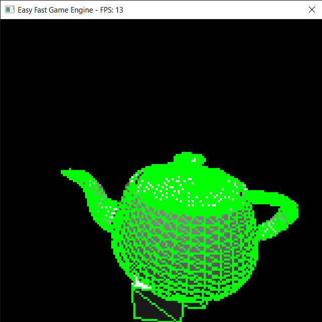
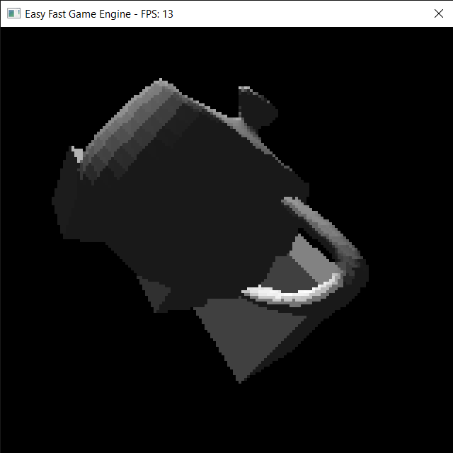

# Simple 3D Engine

A rudimentary 3D Engine made with olcPixelGameEngine in C++

## Prerequisites

- Visual Studio 15 2017

## Screenshots

## Useful Links

- [Microsoft Visual Studio](https://visualstudio.microsoft.com)
- [OneLoneCoder](https://onelonecoder.com/) website
